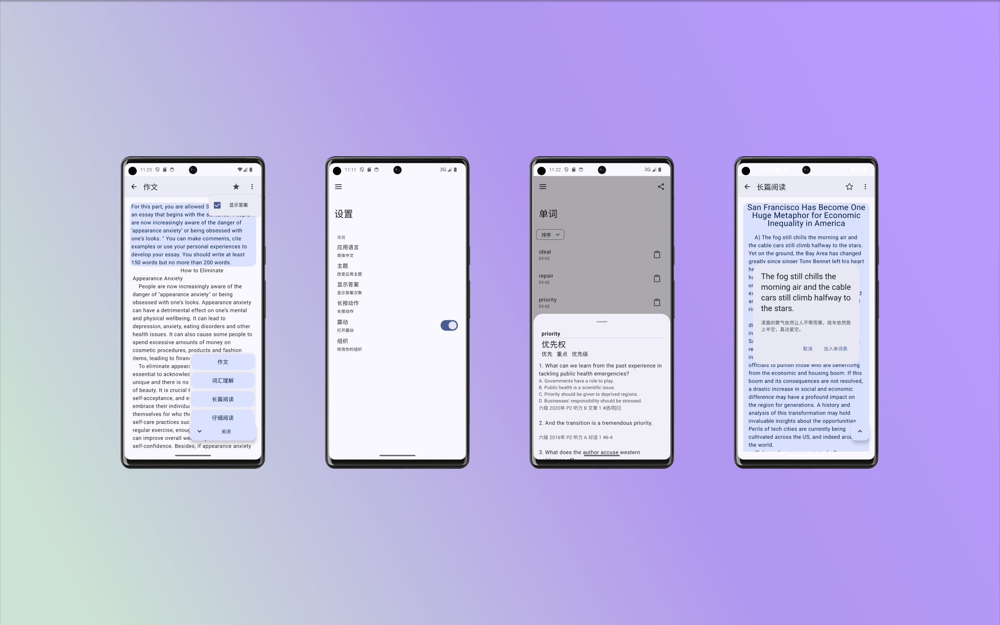
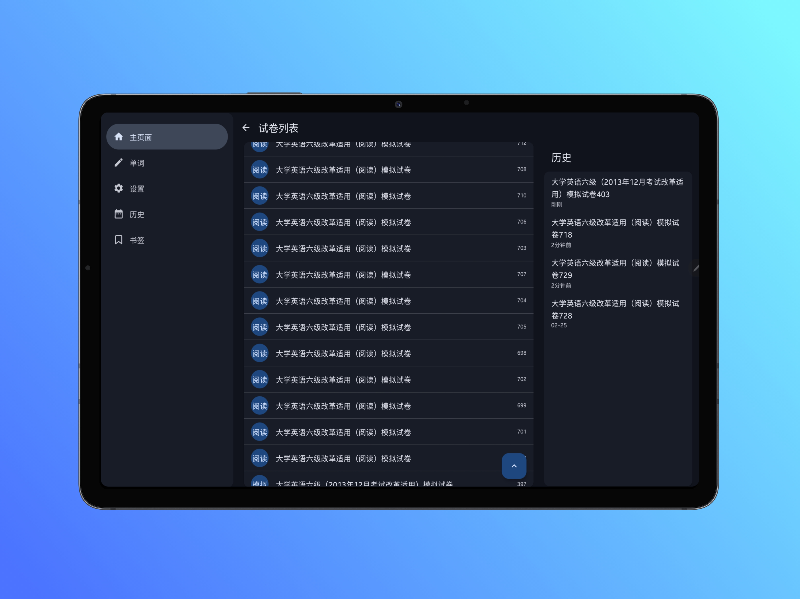

# VipExam

VipExam is a Material You style third-party Android client for vipexam. It provides a simple and
intuitive interface for users to conveniently access various features
of [vipexam.cn](https://vipexam.cn).

## Features

Browse and search question banks: Users can browse and search question banks available on
vipexam.cn, including following exams and subjects:

- [x] CET6
- [ ] CET4
- [ ] Postgraduate Entrance Examination English I/II

Mock exams: Users can take mock exams to assess their exam preparation.
Favorites: Users can bookmark interesting questions.
History: Users can view their exam history.
Translation: Users can long press to translate content and add to word list.

## Screenshots




## Installation

You can obtain the VipExam application from the following sources:

Github Releases: You can download the latest APK file from the project's Github Release page and
manually install it on your Android device.

## Requirements

Android device running Android 8.0 (API level 26) and above.
Internet connection: VipExam requires an internet connection to fetch question bank data and other
related information.

## License

```plaintext
Copyright 2023-2024 xlei.app

Licensed under the Apache License, Version 2.0 (the "License");
you may not use this file except in compliance with the License.
You may obtain a copy of the License at

    http://www.apache.org/licenses/LICENSE-2.0

Unless required by applicable law or agreed to in writing, software
distributed under the License is distributed on an "AS IS" BASIS,
WITHOUT WARRANTIES OR CONDITIONS OF ANY KIND, either express or implied.
See the License for the specific language governing permissions and
limitations under the License.
```

## Acknowledgments

We would like to express our gratitude to the following open-source projects for their contributions
to VipExam:

- [Kotlin](https://kotlinlang.org/): Kotlin programming language, which provides a modern and
  concise syntax for developing Android applications.
- [Ktor](https://ktor.io/): Ktor is a powerful framework for building asynchronous servers and
  clients in Kotlin. We leverage Ktor for handling network requests in VipExam.
- [Jetpack Compose](https://developer.android.com/jetpack/compose): Jetpack Compose is a declarative
  UI toolkit for building native Android apps. It enables us to create a modern and dynamic user
  interface in VipExam.
- [Hilt](https://dagger.dev/hilt/): Hilt is a dependency injection framework for Android built on
  top of Dagger. We utilize Hilt to facilitate dependency injection and manage the app's component
  hierarchy in VipExam.
- [Room](https://developer.android.com/jetpack/androidx/releases/room): Room is a persistence
  library that provides an abstraction layer over SQLite. We utilize Room to handle database
  operations and manage local data in VipExam.
- [Coil](https://coil-kt.github.io/coil/): Coil is an image loading library for Android. We utilize
  Coil to efficiently load and display images in VipExam.
  